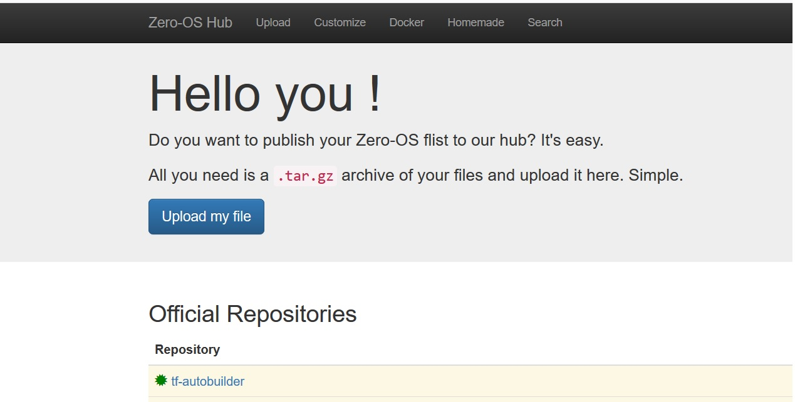

# Dash

To Deploy on Kubernetes, see this link  [Digibyte Helm Charts for K8s](helm)

### How to build from the Dockerfile ?

```
git clone https://github.com/threefoldfoundation/blockchain_partners.git
cd Dash
docker build --tag dash:latest .
```
Sit back and relax then ! It should be quicker and you should see a successful message as below,

```
Step 13/15 : ENTRYPOINT ["/start_dash.sh"]
 ---> Running in 8d1843b0f4ae
Removing intermediate container 8d1843b0f4ae
 ---> 48decfe07a6c
Step 14/15 : VOLUME /dash
 ---> Running in d8760d3619fe
Removing intermediate container d8760d3619fe
 ---> c106e19986e6
Step 15/15 : EXPOSE 9998 9999
 ---> Running in 5ab0874b98d2
Removing intermediate container 5ab0874b98d2
 ---> 2f7f091cc90f
Successfully built 2f7f091cc90f
Successfully tagged dash:2.0
```

### How to run ?

You can then spin the container with your created image. Map host ports as needed,

```docker run -dit --name=dash --hostname=dash -p 9999:9999 -p 9998:9998 dash:latest bash```
 
### How to verify ?

Get into the container with,

```docker exec -it dash bash```

Verify the node runnning by checking the dash process, you could see it running as below,

```
root@dash:/opt# netstat -lntpe
Active Internet connections (only servers)
Proto Recv-Q Send-Q Local Address           Foreign Address         State       User       Inode      PID/Program name
tcp        0      0 0.0.0.0:9999            0.0.0.0:*               LISTEN      0          25022620   27/dashd
tcp        0      0 0.0.0.0:22              0.0.0.0:*               LISTEN      0          25022672   1/sshd
tcp        0      0 0.0.0.0:9998            0.0.0.0:*               LISTEN      0          25022615   27/dashd
tcp6       0      0 :::9999                 :::*                    LISTEN      0          25022619   27/dashd
tcp6       0      0 :::22                   :::*                    LISTEN      0          25022674   1/sshd
```

Check for the dash process if it is running,
```
root@dash:/opt
UID        PID  PPID  C STIME TTY          TIME CMD
root         1     0  0 18:29 pts/0    00:00:00 /usr/sbin/sshd -D
root        27     1 83 18:29 ?        00:01:12 /opt/dash/bin/dashd -conf=/dash/.dashcore/dash.conf
root        56     0  0 18:30 pts/1    00:00:00 bash
```

The default data directory for Dash is /dash/.dashcore where you will see all dash data,

```
:/dash/.dashcore# tree -dh
.
|-- [4.0K]  backups
|-- [4.0K]  blocks
|   `-- [4.0K]  index
|-- [4.0K]  chainstate
|-- [4.0K]  database
|-- [4.0K]  evodb
`-- [4.0K]  llmq

7 directories
```
## Preparing our flist - [Dash flist is here](flist.md)

This should be easy ! Export your docker container as ".tar.gz" and upload it to Threefold's hub @ [https://hub.grid.tf](https://hub.grid.tf)

```docker export your_container_name > docker export your_container_name.tar.gz```



#### - Details of flists for Dash under this link [Dash flists](flist.md)

