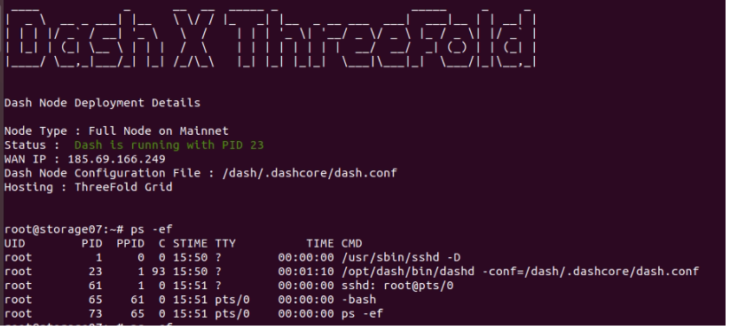

# Dash flists

Link to flist is herein

https://hub.grid.tf/arehman/v2-dash-1-1.flist

This flist uses the following version of Dashcore's binary,
- Dash Core RPC client version v0.15.0.0

In case there is a new version, you can always update the URL in the Dockerfile, build a new image and create an flist. To know more about Dash's binary and its usage, [See this link](https://github.com/dashpay/dash/releases)

If your container is deployed successfully, you should see



### Configuration 

#### Environment Variables

```
* pub_key - This is your SSH public key (ed25519)
```
Edit the [Dockerfile](Dockerfile) and modify the script [start_dash.sh](scripts/start_dash.sh) to customize your startup and node settings. For the node, you can directly modify the [dash configuration file](config/dash.conf) that is used to build the docker image.
