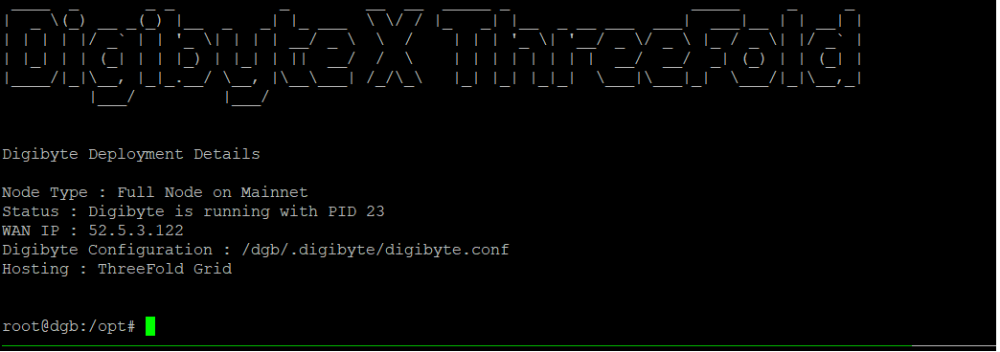

# DigiByte flists

Link to flist is herein

https://hub.grid.tf/arehman/v2-dgb-1-1.flist

This flist uses the following version of Digibyte's binary,
- DigiByte Core v7.17.2 Official Release 

In case there is a new version, you can always update the URL in the Dockerfile, build a new image and create an flist. To know more about Digibyte's binary and its usage, [See this link](https://github.com/digibyte/digibyte/releases)

If your container is deployed successfully, you should see



### Configuration 

#### Environment Variables

```
* pub_key - This is your SSH public key (ed25519)
```
Edit the [Dockerfile](Dockerfile) and modify the script [start_dgb.sh](scripts/start_dgb.sh) to customize your startup and node settings. For the node, you can directly modify the [digibyte configuration file](config/digibyte.conf) that is used to build the docker image.
