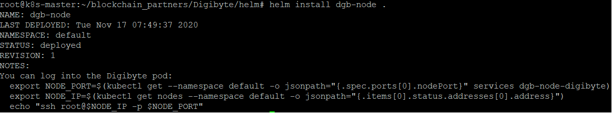

## Digibyte - Helm chart for Kubernetes Deployment

This is a basic helm chart that allows to run Digibyte full node on a Kubernetes cluster.

### How to Deploy ?
```
git clone https://github.com/threefoldfoundation/blockchain_partners.git
cd Digibyte/helm
helm install dgb-node .
```
Here dgb-node is the node name which you can be changed as per requirements. If the install is successful, here is what you should see below,



```
NAME: dgb-node
LAST DEPLOYED: Tue Nov 17 07:49:37 2020
NAMESPACE: default
STATUS: deployed
REVISION: 1
NOTES:
```


Next you need to run the 3 commands to SSH into the pod,
```
export NODE_PORT=$(kubectl get --namespace default -o jsonpath="{.spec.ports[0].nodePort}" services dgb-node-digibyte)
export NODE_IP=$(kubectl get nodes --namespace default -o jsonpath="{.items[0].status.addresses[0].address}")
echo "ssh root@$NODE_IP -p $NODE_PORT"
```

