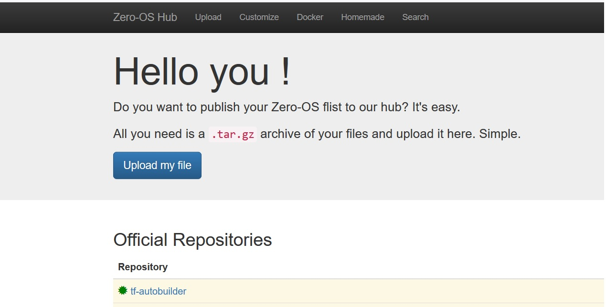

# Harmony

### How to build from the Dockerfile ?

```
git clone https://github.com/threefoldfoundation/blockchain_partners.git
cd Harmony
docker build --tag hmy:latest .
```

Sit back and relax then ! It should be quicker and you should see a successful message as below,
```
Step 9/11 : ENTRYPOINT ["/start_hmy.sh"]
 ---> Running in 9ced8faf67d2
Removing intermediate container 9ced8faf67d2
 ---> e342505a5f7d
Step 10/11 : VOLUME /opt
 ---> Running in 4e7345d19aa7
Removing intermediate container 4e7345d19aa7
 ---> 2d1c2fe2e513
Step 11/11 : EXPOSE 9000 6000
 ---> Running in 9f0ec25de1df
Removing intermediate container 9f0ec25de1df
 ---> 2f40515c3619
Successfully built 2f40515c3619
Successfully tagged hmy:latest
```

### How to run ?

You can then spin the container with your created image. Map host ports as needed,

```docker run -dit --name=harmony --hostname=harmony -p 9000:9000 -p 6000:6000 hmy:latest bash```

### How to verify ?
Get into the container with,

```docker exec -it harmony bash```

Verify the node runnning by checking the harmony process, you could see it running as below

```
root@hmny:/opt# netstat -lntpe
Active Internet connections (only servers)
Proto Recv-Q Send-Q Local Address           Foreign Address         State       User       Inode      PID/Program name
tcp        0      0 0.0.0.0:22              0.0.0.0:*               LISTEN      0          12490418   1/sshd
tcp        0      0 127.0.0.1:9500          0.0.0.0:*               LISTEN      0          12491157   59/./harmony
tcp        0      0 127.0.0.1:9800          0.0.0.0:*               LISTEN      0          12491158   59/./harmony
tcp        0      0 0.0.0.0:9000            0.0.0.0:*               LISTEN      0          12491137   59/./harmony
tcp        0      0 0.0.0.0:6000            0.0.0.0:*               LISTEN      0          12491141   59/./harmony
tcp6       0      0 :::22                   :::*                    LISTEN      0          12490420   1/sshd
tcp6       0      0 :::5000                 :::*                    LISTEN      0          12490549   59/./harmony

```

The default data directory for Digibyte is /opt where you will see all harmony data,

```
root@dgb:/opt# tree -dh
.
|-- [4.0K]  blocks
|   `-- [4.0K]  index
|-- [4.0K]  chainstate
`-- [4.0K]  database

4 directories
```

## Preparing our flist - [Harmony flist is here](flist.md)

This should be easy ! Export your docker container as ".tar.gz" and upload it to Threefold's hub @ [https://hub.grid.tf](https://hub.grid.tf)

```docker export your_container_name > docker export your_container_name.tar.gz```



#### - Details of flists for Harmony under this link [Harmony flists](flist.md)
