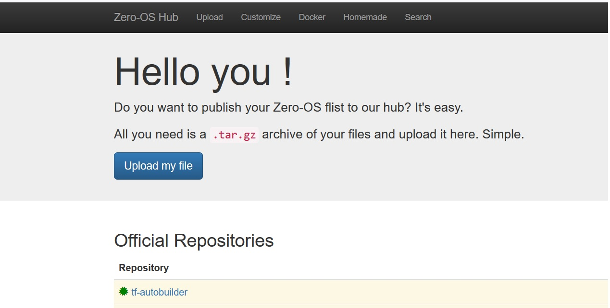

# Tomochain

To Deploy on Kubernetes, see this link  [TomoChain Helm Charts for K8s](helm)

### How to build from the Dockerfile ?

```
git clone https://github.com/threefoldfoundation/blockchain_partners.git
cd Tomochain
docker build --tag tomo:latest .
```

Sit back and relax then ! It should be quicker and you should see a successful message as below,

```
Step 13/17 : ENV NETSTATS_PORT ''
 ---> Using cache
 ---> 7f8d60c61c7e
Step 14/17 : COPY scripts/start_tomo.sh /
 ---> Using cache
 ---> c1954b60c2a8
Step 15/17 : COPY config/tomo /opt
 ---> Using cache
 ---> 1350fbb4fe6b
Step 16/17 : EXPOSE 8545 8546 30303 30303/udp
 ---> Running in c1611138db7f
Removing intermediate container c1611138db7f
 ---> 13f4041c7146
Step 17/17 : VOLUME /opt
 ---> Running in d9b4fef858f4
Removing intermediate container d9b4fef858f4
 ---> 1e6d1a3ce0ea
Successfully built 1e6d1a3ce0ea
Successfully tagged tomo:latest
```

### How to run ?

You can then spin the container with your created image. Map host ports as needed,

```docker run -dit --name=tomo --hostname=tomo -p 8545:8545 -p 8546:8546 -p 30303:30303 -p 30303:30303/udp tomo:latest bash```


### How to verify ?
Get into the container with,

```docker exec -it tomo bash```

Verify the node runnning by checking the tomo process, you could see it running as below by using the commands,

```
#netstat -lntupe
Active Internet connections (only servers)
Proto Recv-Q Send-Q Local Address           Foreign Address         State       User       Inode      PID/Program name
tcp        0      0 0.0.0.0:22              0.0.0.0:*               LISTEN      0          15713202   1/sshd
tcp6       0      0 :::30303                :::*                    LISTEN      0          15714306   26/tomo
tcp6       0      0 :::22                   :::*                    LISTEN      0          15713207   1/sshd
udp6       0      0 :::30303                :::*                                0          15714295   26/tomo

# ps -ef
UID        PID  PPID  C STIME TTY          TIME CMD
root         1     0  0 09:28 pts/0    00:00:00 /usr/sbin/sshd -D
root        26     1  7 09:28 pts/0    00:00:05 /opt/tomo --syncmode full --announce-txs --datadir /opt/data --networkid 88 --port 30303 --keystore /opt/keys --password /opt/keys/pass.txt -
root        38     0  0 09:28 pts/1    00:00:00 bash
```

The default data directory for harmony is /opt where you will see all tomo data,

```
# tree -dh
.
|-- [4.0K]  data
|   |-- [4.0K]  tomo
|   |   |-- [4.0K]  chaindata
|   |   `-- [4.0K]  nodes
|   `-- [4.0K]  tomox
`-- [4.0K]  keys

```

## Preparing our flist - [Tomo flist is here](flist.md)

This should be easy ! Export your docker container as ".tar.gz" and upload it to Threefold's hub @ [https://hub.grid.tf](https://hub.grid.tf)

```docker export your_container_name > docker export your_container_name.tar.gz```



#### - Details of Tomo flists under this link [Tomo flists](flist.md)
